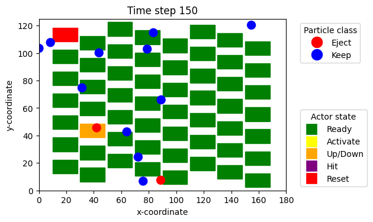

# 2DArraySorting_SNMPC

This repository contains the reference implementation accompanying the paper

> **Breaking the Pneumatic Barrier: Optimal Control of Mechanically Actuated
> 2D Grids for High-Throughput, Energy-Efficient Sensor-based Sorting**
> Marcel Reith-Braun, Felix Kronenwett, Preetham Suresh, Georg Maier,
> Harald Kruggel-Emden, Thomas Längle, Jürgen Beyerer, Florian Pfaff,
> and Uwe D. Hanebeck. 
> MDPI Sensors Special Issue: *Advanced Sensor-Based Sorting & Control:
Perspectives and Potentials for Securing Valuable Raw Materials*, to appear.



The software simulates sensor-based sorting with a two-dimensional actuator
array and implements partially time-continuous control with rollout (PTCR).
The controller combines a first-actor-first rollout heuristic with an
assumed-density filter (ADF)-inspired prediction model.
PTCR and the heuristics can also be imported stand-alone for controlling a
real-world grid sorting system.
Monte-Carlo validation tools are included for the ADF and its cost evaluation.

## Repository contents

- `main.py`: command-line entry point for the two-dimensional simulation.
- `ptcr_controller.py`, `ptcr_config.py`: PTCR controller and configuration
  handling.
- `adf/`: implementation of the ADF-inspired forward model.
- `adf_mc_validation/`: Monte-Carlo validation and plotting utilities.
- `controller_configs/ptcr_config.json`: standard PTCR configuration.
- `controller_configs/adf_mc_partial_hit_verification.json`: complete
  configuration for Figures A1 and A2.
- `controller_configs/adf_mc_cost_verification.json`: complete configuration
  for Table A1.
- `tests/`: unit and integration tests.
- `dockerfile/Dockerfile`: Docker environment used by the project CI.
- `Adaptive_Filtering/`: Git submodule containing the tracking dependency. It
  is required only when simulating the controller with the matching tracker
  (`--use_mtt_tracker`); without this flag, the simulation runs independently.

## Requirements

The recommended way to run the code is Docker. The image is based on
TensorFlow 2.16.1 with GPU support and installs the remaining Python
requirements listed in `dockerfile/Dockerfile`.

## Running with Docker

Build the project image from the repository root:

```bash
docker build -t tensorflow/twodarraysorting_snmpc:2.16.1-gpu dockerfile
```

### Start the Docker container

The standard command starts the GPU-enabled image, mounts the repository at
`/mnt`, and enables Linux display forwarding:

```bash
docker run -u $(id -u):$(id -g) --gpus all -it --rm \
  -e DISPLAY=$DISPLAY \
  -v /tmp/.X11-unix:/tmp/.X11-unix \
  -v </path/to/repo>:/mnt \
  tensorflow/twodarraysorting_snmpc:2.16.1-gpu
```

For a CPU-only run, omit `--gpus all`. If the repository is located
elsewhere, replace the host-side path in the `/mnt` volume mount.

### Run the program and inspect its flags

Inside the container, run the default two-dimensional simulation (while showing the animation) with:

```bash
python3 /mnt/main.py \
  --controller ptcr \
  --controller_config_path /mnt/controller_configs/ptcr_config.json \
  --simulation_noise 0.0000001 \
  --configuration B \
```

The animation is interactive.
The sorting progress can be interrupted by pressing `x` (after clicking inside the animation area), which
activates a manual _press mode_. In press mode any key (except of `y`) advances to the next frame. To exit press
mode and return to flush mode, press `y`. 
For reproducible measurements and paper
experiments, disable it with `--no_show_animation`. To see all supported
options and their descriptions, use:

```bash
python3 /mnt/main.py --help
```

To run the heuristic controller instead of PTCR, use:

```bash
python3 /mnt/main.py \
  --controller first_actor_first \
  --simulation_noise 0.0000001 \
  --configuration B \
```


## Configuration

`controller_configs/ptcr_config.json` is the standard PTCR configuration.
Paper-specific configuration entries describe deviations from this standard
configuration. The main PTCR parameters are:

- `accept_cost_weight`, where `1 - c` is the complementary cost weight used
  in the paper.
- `N_R`, the rollout depth.
- `max_branches`, denoted by `N_B` in the paper.
- `retain_faf_candidate`, which enables retention of the first-actor-first
  candidate when set to `true`.

The particle model and the nested `adf.mc_comparison` block are configured in
the same JSON file. The `mc_comparison` block controls validation, plots,
sample counts, output directories, and cost evaluation.

## Reproducing the paper results

The following commands assume that the repository is mounted at `/mnt`, as in
the Docker examples. They use the standard configuration unless stated
otherwise. Results are written below `/mnt/results/` by the configured output
path.

### Simulation results — Table 1 and Table A2

Standard mass flow:

```bash
python3 /mnt/main.py \
  --controller ptcr \
  --controller_config_path /mnt/controller_configs/ptcr_config.json \
  --simulation_noise 0.0000001 \
  --configuration B \
  --no_show_animation \
  --save_results \
  --total_num_particles 100000
```

High mass flow:

```bash
python3 /mnt/main.py \
  --controller ptcr \
  --controller_config_path /mnt/controller_configs/ptcr_config.json \
  --simulation_noise 0.0000001 \
  --configuration B \
  --no_show_animation \
  --save_results \
  --total_num_particles 100000 \
  --mass_flow high
```

To reproduce different PTCR settings, change `accept_cost_weight`, `N_R`,
`max_branches`, or `retain_faf_candidate` in the configuration file.

### ADF Monte-Carlo verification — Figures A1 and A2

Run the verification with:

```bash
python3 /mnt/main.py \
  --controller ptcr \
  --controller_config_path /mnt/controller_configs/adf_mc_partial_hit_verification.json \
  --simulation_noise 0.0000001 \
  --configuration B \
  --no_show_animation \
  --measurement_noise 0.001 \
  --use_mtt_tracker \
  --match_tracker_noise \
  --feed_only_tracks_close_to_array_to_controller \
  --particle_simulator_seed 98765
```

ADF Monte-Carlo verification can also be run without the submodule dependency
by removing `--use_mtt_tracker`.

### ADF Monte-Carlo cost verification — Table A1

Run:

```bash
python3 /mnt/main.py \
  --controller ptcr \
  --controller_config_path /mnt/controller_configs/adf_mc_cost_verification.json \
  --simulation_noise 0.0000001 \
  --configuration B \
  --no_show_animation \
  --measurement_noise 0.001 \
  --use_mtt_tracker \
  --match_tracker_noise \
  --feed_only_tracks_close_to_array_to_controller
```

## Testing

Run the complete test suite from the repository root:

```bash
python3 -m unittest discover /mnt/tests '*_test.py'
```

The Docker image is recommended for testing. Tests should generally be run
without GPU passthrough to avoid GPU memory being retained between test cases:

```bash
docker run --rm \
  -v </path/to/repo>:/mnt \
  tensorflow/twodarraysorting_snmpc:2.16.1-gpu \
  python3 -m unittest discover /mnt/tests '*_test.py'
```

## Reproducibility notes

- Use the documented particle seed where one is provided.
- Keep the standard configuration unchanged except for the listed
  paper-specific deviations.
- Use `--no_show_animation` for runtime measurements.
- Monte-Carlo output directories must be writable by the container user.
- Numerical results can vary slightly across hardware, TensorFlow versions,
  and parallel numerical kernels.

## Citation

If you use this repository, please cite the accompanying paper:

```bibtex
@article{reithbraun_breaking_pneumatic_barrier,
  author = {Reith-Braun, Marcel and Kronenwett, Felix and Suresh, Preetham
            and Maier, Georg and Kruggel-Emden, Harald and Längle, Thomas
            and Beyerer, Jürgen and Pfaff, Florian and Hanebeck, Uwe D.},
  title = {Breaking the Pneumatic Barrier: Optimal Control of Mechanically
           Actuated 2D Grids for High-Throughput, Energy-Efficient
           Sensor-based Sorting},
  journal = {Sensors},
  note = {MDPI Sensors Special Issue: Advanced Sensor-Based Sorting \& Control:
          Perspectives and Potentials for Securing Valuable Raw Materials;
          to appear}
}
```

## Contributing and support

Please open an issue for reproducibility problems, implementation bugs, or
questions about the experiments. Contributions should include tests where
appropriate and should preserve the documented paper-reproduction commands.
